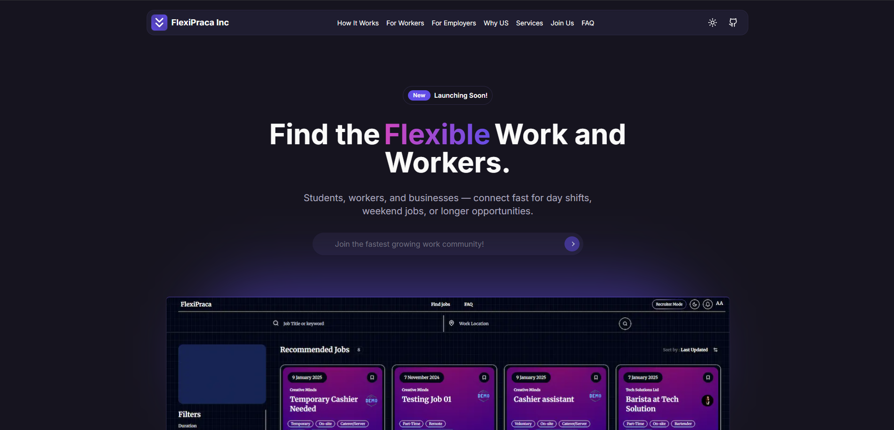
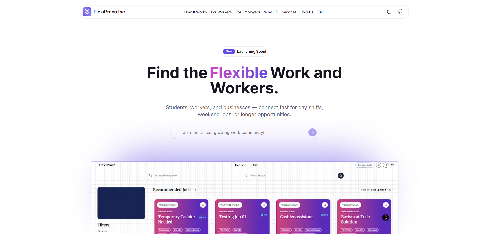

# FlexiPraca App Waitlist

## <a href="https://ui.shadcn.com/" target="_blank">Shadcn</a> + <a href="https://nextjs.org/" target="_blank">Next.js</a> + <a href="https://www.typescriptlang.org/" target="_blank">TypeScript</a> + <a href="https://tailwindcss.com/" target="_blank">Tailwind</a>.




## Sections

- [x] Navbar
- [x] Sidebar(mobile)
- [x] Hero
- [x] Sponsors
- [x] Benefits
- [x] Features
- [x] Community
- [x] Contact
- [x] Frequently Asked Questions(FAQ)
- [x] Services
- [x] Footer

## Features

- [x] Fully Responsive Design
- [x] User Friendly Navigation
- [x] Dark Mode

## How to install

1. Clone this repositoy:

```bash
git clone https://github.com/aymendev1/FlexiPraca-Waitlist.git
```

2. Go into project

```bash
cd FlexiPraca-Waitlist
```

3. Install dependencies

```bash
npm install
```

4. Run project

```bash
npm run dev
```

## Contact

For any questions or feedback, please contact [aymendev1](https://aymendev1.com/?utm_source=github).
